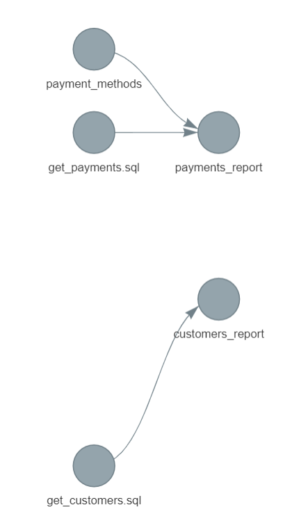

<!-- README.md is generated from README.Rmd. Please edit that file -->

```{r, include = FALSE}
knitr::opts_chunk$set(
  collapse = TRUE,
  comment = "#>"
)
```

# sqltargets-demo

<!-- badges: start -->
<!-- badges: end -->

This repository features a small [sqltargets](https://github.com/daranzolin/sqltargets) demo. Namely, passing parameters to a query via 'Jinja' like syntax. 

# Installation 

Clone the repo and run `get_and_load_data.R`. Then run `targets::tar_make()` to run the pipeline.

```
> tar_make()
• start target payment_methods
• built target payment_methods [0.11 seconds]
• start target get_customers.sql
• built target get_customers.sql [0.08 seconds]
• start target get_payments.sql
• built target get_payments.sql [0.06 seconds]
• start target customers_report
✔ get_customers.sql executed:
Rows: 100
Columns: 7
• built target customers_report [0.47 seconds]
• start target payments_report
✔ get_payments.sql executed:
Rows: 99
Columns: 4
• built target payments_report [0.16 seconds]
• end pipeline [0.98 seconds]
```

Run `tar_glimpse()` to view the dependency lineage:




